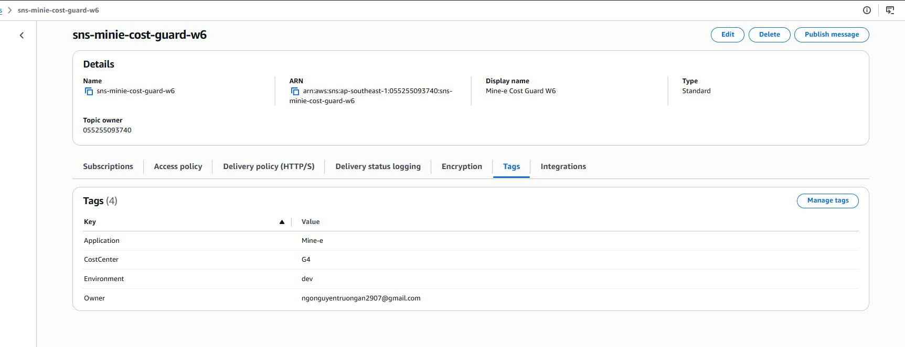

## Evidence Pack W5 bổ sung
## 1 Feedback scaling MH5
## Cấu hình Environment Variables cho Lambda
- Thêm environment variables:
+ TABLE_NAME = minie-media-metadata
+ TEST_DELAY_MS = 10000
- Ý nghĩa:
TABLE_NAME:
Tên DynamoDB table để Lambda PutItem.
- TEST_DELAY_MS:
Delay nhân tạo để mỗi Lambda invocation chạy lâu hơn.
Mục tiêu là làm concurrency tăng rõ hơn khi upload nhiều file vào S3.
## Thử bật Reserved Concurrency
- Theo feedback, nhóm thử bật Reserved Concurrency cho Lambda để giới hạn concurrency.
- Tuy nhiên account free tier hiện có:
+ Unreserved account concurrency: 10
- Khi set Reserved Concurrency, AWS Console báo lỗi:
+ The unreserved account concurrency can't go below 100.
- Vì Lambda yêu cầu account phải giữ lại ít nhất 100 unreserved concurrency, trong khi free tier account chỉ có concurrency quota thấp, nhóm không thể bật Reserved Concurrency = 1.
- Do đó nhóm chuyển sang cách thay thế:
Dùng account concurrency limit hiện tại để tạo Throttles spike.

## Upload hàng loạt file vào S3
- Tạo nhiều file test bằng PowerShell:
```text
mkdir mh5-bulk-strong

1..300 | ForEach-Object {
  "MH5 throttle test file $_" | Out-File -Encoding utf8 "mh5-bulk-strong\bulk-$_.jpg"
}
```
- Upload vào bucket mới:
```Text
aws s3 cp .\mh5-bulk-strong s3://media-s3-minie-mh5-055255093740/products/mh5-bulk-strong/ `
  --recursive `
  --region ap-southeast-1
```
## Kiểm tra CloudWatch Metrics
- Vào Lambda → lambda-minie-media-metadata → Monitor → Metrics
- Chọn:
+ Time range: 1h
+ Period: 1 minute

**Ý nghĩa:**
- S3 đã trigger nhiều Lambda invocations.
- Lambda concurrent executions tăng tới giới hạn account là 10.
- Các invocations vượt quá giới hạn bị throttle.
- CloudWatch Metrics xuất hiện Throttles spike.
## Kiểm tra DynamoDB


#  Evidence Pack — W6 Mine-e AWS Operations

> **Project:** Mine-e E-commerce  
> **Region:** `ap-southeast-1` (Singapore)  
> **Environment:** `dev`  
> **Workload:** ECS Fargate Backend + RDS MySQL + ALB + S3  


---
# Project Recap

## 1. Giới thiệu dự án

Mine-e là một ứng dụng thương mại điện tử. Ứng dụng cho phép người dùng truy cập frontend, xem dữ liệu sản phẩm và sử dụng backend API để xử lý các chức năng nghiệp vụ liên quan đến sản phẩm, người dùng và media/image sản phẩm.

Trong W6, nhóm redeploy workload chính của Mine-e lên AWS và bổ sung các lớp vận hành để chứng minh hệ thống không chỉ chạy được, mà còn có thể:

```text
- Theo dõi và phân bổ chi phí theo workload.
- Tự động hành động để giảm chi phí.
- Quan sát được trạng thái ứng dụng bằng logs, metrics, dashboard và alarm.
- Tự động sửa một security misconfiguration trên S3.
```

---

## 2. Business domain

Business domain của Mine-e là **E-commerce**. Các thành phần nghiệp vụ chính gồm:

```text
Product catalog
Product media/images
Backend API
Database lưu dữ liệu ứng dụng
Frontend cho người dùng truy cập
```

Vì Mine-e có dữ liệu sản phẩm và ảnh sản phẩm, nhóm chọn **media workflow** làm use case chính cho monitoring:

```text
Upload ảnh vào S3
        ↓
Lambda xử lý metadata
        ↓
Ghi metadata vào DynamoDB
        ↓
Publish custom metrics lên CloudWatch
```

Luồng này phù hợp với domain thương mại điện tử vì ảnh sản phẩm là một phần quan trọng của ứng dụng.

---

## 3. Kiến trúc chính của Mine-e W6

Workload Mine-e W6 gồm các thành phần chính:

```text
Frontend:
S3 static website bucket minie-fe-w6

Backend:
ECS Fargate Service minie-backend-task-w6-service

Entry point:
Application Load Balancer

Database:
RDS MySQL

Media storage:
S3 bucket media-s3-minie-w6

Observability:
S3 Event → Lambda → DynamoDB → CloudWatch

Cost automation:
Lambda Cost Guard + EventBridge Scheduler + SNS/Budget path

Security automation:
Lambda S3 Security Guard + EventBridge Scheduler + CloudTrail

Preventive security control:
S3 Account-level Block Public Access + bucket policy deny non-TLS
```

Luồng truy cập chính:

```text
User
  ↓
S3 static frontend
  ↓
Application Load Balancer
  ↓
ECS Fargate backend
  ↓
RDS MySQL
```

Luồng media/observability:

```text
S3 media upload
  ↓
Lambda media observability
  ↓
DynamoDB metadata table
  ↓
CloudWatch logs, custom metrics, dashboard, alarm
```

---
## 4. Các quyết định cost-aware trong W6

W6 có hard cost cap `$150`, nên nhóm ưu tiên cấu hình tiết kiệm chi phí nhưng vẫn đủ để chứng minh các control vận hành.

Các quyết định cost-aware gồm:

```text
RDS Single-AZ thay vì Multi-AZ
ECS desired task count = 1
Lambda Cost Guard scale ECS desiredCount về 0 khi cần
Không redeploy Redis/EFS/Network Firewall nếu không phục vụ trực tiếp cho W6
Dùng Lambda, EventBridge và SNS cho automation chi phí thấp
Dùng S3 Static Website endpoint làm fallback khi CloudFront bị account verification chặn
```

Nhóm không sử dụng AWS Network Firewall trong W6 vì W6 không chấm lại network hardening của W5. Tuần này tập trung vào cost visibility, cost control, monitoring và self-healing security. Network Firewall không bắt buộc cho 4 must-have W6 và có thể làm tăng chi phí trong account có hard cap `$150`.

---

# MH-COST-V — Cost Visibility & Attribution

## Mục tiêu

MH-COST-V chứng minh nhóm có khả năng nhìn thấy, phân loại và theo dõi chi phí của workload Mine-e trên AWS.

Phần này tập trung vào:

```text
1. Gắn tag nhất quán cho resource.
2. Activate Cost Allocation Tags trong Billing Console.
3. Cấu hình cost monitoring tool.
4. Phân tích baseline cost breakdown.
5. Trình bày tagging strategy và cách enforce trong production.
```

---

## Tagging Strategy

Nhóm sử dụng 4 tag bắt buộc cho các resource của Mine-e W6:

| Tag key | Value | Mục đích |
|---|---|---|
| Owner | ngonguyentruongan2907@gmail.com | Người chịu trách nhiệm workload |
| Environment | dev | Phân loại môi trường |
| CostCenter | G4 | Phân bổ chi phí theo nhóm |
| Application | Mine-e | Nhận diện workload/application |

### Quy tắc tagging

```text
- Tag key phải viết nhất quán.
- Dùng Owner, không dùng owner.
- Dùng Environment=dev, không dùng Dev hoặc DEV.
- Dùng CostCenter=G4 để phân bổ chi phí cho nhóm.
- Dùng Application=Mine-e để nhận diện toàn bộ workload Mine-e.
```

### Resource cần gắn tag

Các resource billable/redeployed chính đã được gắn tag:

```text
RDS MySQL
ECS Service
Application Load Balancer
S3 bucket
VPC resources
Security Groups
ECR repository
Lambda functions
DynamoDB table
SNS topics
EventBridge schedules
CloudWatch log groups / alarms
```

---

# MH-COST-V-A — Evidence tags trên RDS


## Ý nghĩa

RDS là một trong các cost driver chính vì database chạy liên tục. Việc gắn tag giúp xác định chi phí database thuộc về workload Mine-e, môi trường dev và nhóm G4.

---

# MH-COST-V-B — Evidence tags trên ECS Service


## Ý nghĩa

ECS Fargate phát sinh chi phí theo thời gian chạy task, vCPU và memory. Tag ECS Service giúp phân bổ chi phí backend container về đúng workload Mine-e.

---

# MH-COST-V-C — Evidence tags trên S3 bucket


## Ý nghĩa

S3 bucket lưu media/image của Mine-e. Tag giúp phân loại storage cost và request cost của bucket này về workload Mine-e.

---

# MH-COST-V-D — Evidence tags trên Application Load Balancer


## Ý nghĩa

ALB là public entry point của backend và phát sinh chi phí theo thời gian chạy cùng LCU. Tag ALB giúp xác định chi phí load balancing thuộc về Mine-e.

---

# MH-COST-V-E — Activate Cost Allocation Tags

## Mục tiêu

Sau khi gắn tag lên resource, các tag này cần được activate trong Billing Console để có thể dùng trong Cost Explorer, Cost and Usage Reports và các báo cáo chi phí theo tag.

Các tag cần activate:

```text
Application
CostCenter
Environment
Owner
```


## Cách activate

Vào:

```text
Billing and Cost Management
→ Cost Allocation Tags
→ User-defined cost allocation tags
```

Tick chọn 4 tag:

```text
Application
CostCenter
Environment
Owner
```

Sau đó bấm:

```text
Activate
```

## Trạng thái sau khi activate


## Ý nghĩa

Việc activate Cost Allocation Tags giúp nhóm có thể phân tích chi phí theo:

```text
Application = Mine-e
CostCenter = G4
Environment = dev
Owner = ngonguyentruongan2907@gmail.com
```

Đây là phần quan trọng để chuyển từ “resource có tag” sang “chi phí có thể được phân bổ theo tag”.

---

# MH-COST-V-F — AWS Budget $150

## Mục tiêu

Cấu hình cost monitoring tool để kiểm soát hard cost cap của W6.

Budget được tạo:

| Mục | Giá trị |
|---|---|
| Budget name | Mine-e-W6-150USD |
| Budget amount | 150 USD |
| Threshold | 80% và/hoặc 100% |
| Trigger | Actual cost |
| Notification | Email và/hoặc SNS |

## Ý nghĩa

AWS Budget giúp nhóm theo dõi chi phí thực tế và nhận cảnh báo khi chi phí tiến gần giới hạn `$150`.

Với threshold 80%, alert sẽ kích hoạt khi actual cost vượt:

```text
80% của $150 = $120
```


---


# MH-COST-V-H — Cost Explorer / Service-level cost view

## Mục tiêu

Cost Explorer được dùng để xem breakdown chi phí theo service hoặc theo tag sau khi Cost Allocation Tags đã được active và Billing data đã được cập nhật.

Cấu hình Cost Explorer mong muốn:

```text
Date range: This month hoặc Last 7 days
Granularity: Daily
Group by: Service
Filter: Application=Mine-e hoặc CostCenter=G4 nếu tag đã active và propagation xong
```

## Lưu ý propagation

Sau khi activate Cost Allocation Tags, AWS Billing có thể cần thời gian để tag xuất hiện trong Cost Explorer. Nếu chưa filter được ngay theo tag, nhóm có thể dùng service-level breakdown trước.

## Evidence

TODO: Chèn ảnh Cost Explorer grouped by Service nếu có.

```md

```

TODO: Chèn ảnh Cost Explorer filter theo tag nếu đã dùng được.

```md

```

Nếu Cost Explorer chưa có data ngay, ghi:

```text
Cost Allocation Tags were activated, but Billing/Cost Explorer data may need time to propagate. The team used Budget and service-level expected cost breakdown while waiting for tag-based cost data.
```

---

# MH-COST-V-I — Baseline cost breakdown

## Expected top cost drivers

Dựa trên kiến trúc redeploy của Mine-e W6, các cost driver chính dự kiến gồm:

| Thứ tự | Cost driver | Lý do |
|---:|---|---|
| 1 | RDS MySQL | Database chạy liên tục |
| 2 | NAT Gateway / EC2-Other | Private subnet cần outbound để ECS pull image, gửi logs và truy cập internet |
| 3 | Application Load Balancer | Entry point public cho backend |
| 4 | ECS Fargate | Backend container runtime |
| 5 | S3 / CloudWatch | Lưu file media, logs, metrics, alarms |

## Phân tích cost driver

### 1. RDS MySQL

RDS là cost driver quan trọng vì database chạy liên tục kể cả khi traffic thấp. Nhóm chọn RDS Single-AZ để giảm chi phí trong môi trường W6/dev.

### 2. NAT Gateway / EC2-Other

ECS task trong private subnet cần outbound internet để pull image, gửi logs hoặc truy cập endpoint bên ngoài. NAT Gateway có hourly charge và data processing charge, nên cần được theo dõi kỹ.

### 3. Application Load Balancer

ALB là entry point public cho backend. ALB phát sinh chi phí theo thời gian chạy và LCU.

### 4. ECS Fargate

ECS Fargate phát sinh chi phí theo vCPU, memory và thời gian chạy task. Nhóm để desired task count = 1 và bổ sung Cost Guard để scale down khi cần giảm cost.

### 5. S3 / CloudWatch

S3 lưu media/object của ứng dụng. CloudWatch lưu logs, custom metrics, dashboards và alarms. Chi phí thường nhỏ hơn RDS/NAT/ALB nhưng vẫn cần theo dõi vì log hoặc media có thể tăng theo thời gian.

---

# MH-COST-V-J — Cost-aware deployment decisions

Nhóm đã chọn các cấu hình cost-aware để giữ workload trong giới hạn W6:

```text
RDS Single-AZ thay vì Multi-AZ
ECS desired task count = 1
2 NAT Gateway 
Không redeploy Redis/EFS/Network Firewall nếu không cần
Dùng Lambda/EventBridge cho automation chi phí thấp
```

## Giải thích

W6 không tập trung chính vào High Availability mà tập trung vào cost-aware governance, observability và self-healing operations. Vì vậy, nhóm ưu tiên kiến trúc dev/workshop có chi phí thấp nhưng vẫn đủ để chứng minh các control vận hành.

Với production, kiến trúc có thể nâng cấp:

```text
RDS Multi-AZ
ECS desired task count >= 2
NAT Gateway per AZ
ALB multi-AZ
Autoscaling policy
```

Tuy nhiên, các nâng cấp này không bật full-time trong W6 để tránh vượt hard cost cap `$150`.

---

# MH-COST-A — Automated Cost Guard
**Lambda Cost Guard scale down ECS Fargate Service**

Trong W6, ứng dụng Mine-e backend chạy bằng ECS Fargate. Vì Fargate không có EC2 instance để `StopInstances`, nhóm chọn cách đúng với ECS là gọi API:

```text
ecs:UpdateService
desiredCount = 0
```

Điều này giúp service dev không còn duy trì Fargate task đang chạy, từ đó giảm compute cost khi không cần sử dụng.

---

## Kiến trúc triển khai

```text
EventBridge Scheduler / Manual Test
        ↓
Lambda Cost Guard
        ↓
ecs:DescribeServices
        ↓
ecs:UpdateService desiredCount=0
        ↓
ECS Service scale down
        ↓
CloudTrail ghi nhận UpdateService
```

---

## Các thành phần chính

| Thành phần | Tên / Giá trị | Vai trò |
|---|---|---|
| ECS Cluster | `cluster-minie-w6` | Cluster chạy backend Mine-e |
| ECS Service | `minie-backend-task-w6-service` | Service backend cần scale down |
| Lambda | `lambda-minie-cost-guard-w6` | Automation giảm cost |
| IAM Role | `lambdaRole-minie-cost-guard-w6` | Quyền cho Lambda gọi ECS API |
| EventBridge Schedule | `schedule-minie-cost-guard-w6` | Trigger Lambda theo lịch |
| CloudTrail Event | `UpdateService` | Evidence chứng minh Lambda gọi API ECS |

---

## Lý do chọn ECS `UpdateService desiredCount=0`

Vì Mine-e W6 chạy backend bằng **ECS Fargate**, không có EC2 instance cố định để stop/start. Với ECS Service, số lượng task được điều khiển bằng `desiredCount`.

Khi set:

```text
desiredCount = 0
```

ECS sẽ không duy trì task nào cho service đó. Điều này làm backend dev tạm dừng và giảm chi phí Fargate compute.

### Vì sao không dùng EC2 StopInstances

`StopInstances` chỉ áp dụng cho EC2. ECS Fargate là serverless container runtime, AWS quản lý compute phía sau. Người dùng không thao tác trực tiếp với EC2 instance.

### Vì sao không dùng Reserved Concurrency

Reserved Concurrency phù hợp để giới hạn Lambda concurrency. Nó không trực tiếp giảm cost cho ECS Fargate backend đang chạy.

### Vì sao không dùng Provisioned Concurrency

Provisioned Concurrency dùng cho Lambda latency optimization và có thể tăng chi phí. Nó không phù hợp với mục tiêu giảm compute cost của ECS Service dev.

---

## Trade-off

Scale ECS Service về `desiredCount=0` giúp giảm cost nhưng backend sẽ tạm thời unavailable.

```text
Ưu điểm:
- Giảm cost Fargate khi không cần chạy workload dev.
- Dễ chứng minh bằng ECS Service desired/running task.
- CloudTrail ghi lại hành động UpdateService.

Nhược điểm:
- Backend tạm thời down.
- Khi cần demo tiếp phải scale service lại desiredCount=1.
- Không phù hợp nếu đây là production workload cần always-on.
```

Kết luận:

> Với môi trường W6/dev có hard cost cap $150, scale down ECS Service là hợp lý. Với production, có thể dùng lịch scale-down theo giờ thấp điểm hoặc giữ desiredCount >= 2 để đảm bảo HA.

---

# MH-COST-A-1 — Evidence ECS trước khi chạy Cost Guard

## Mục tiêu

Trạng thái ECS Service trước khi Lambda Cost Guard chạy.

Trước khi scale down, service phải đang chạy bình thường:


## Ý nghĩa

Ảnh này chứng minh workload Mine-e backend đang chạy bình thường trước khi automation giảm cost được kích hoạt.

---

# MH-COST-A-2 — Tạo IAM Role cho Lambda Cost Guard

## Mục tiêu

Tạo IAM Role để Lambda có thể:

```text
Ghi log vào CloudWatch
Describe ECS Service
Update ECS Service desiredCount
List tag của ECS resource nếu cần
```
- Vào: IAM → Roles → Create role
- Chọn: Trusted entity type: AWS service
- Use case: Lambda
- Bấm Next
- Ở phần permissions, tìm và tick: AWSLambdaBasicExecutionRole
- Policy này cho Lambda ghi log vào CloudWatch.
- Bấm Next
- Role name: lambdaRole-minie-cost-guard-w6
- Sau khi tạo role xong, vào role: IAM → Roles → lambdaRole-minie-cost-guard-w6
- Chọn: Permissions → Add permissions → Create inline policy
- Chọn tab JSON, dán policy này:

## Ghi chú least privilege

Trong bản workshop, policy có thể dùng `Resource: "*"` để tránh lỗi ARN trong quá trình demo. Trong production, nên giới hạn resource về đúng ECS Cluster/Service ARN của Mine-e.


# MH-COST-A-3 — Tạo Lambda Cost Guard

## Mục tiêu

Tạo Lambda function thực hiện:

```text
1. Describe ECS Service hiện tại
2. Log desiredCount/runningCount trước khi scale down
3. Gọi UpdateService desiredCount=0
4. Trả response thành công
```

## Lambda information

| Mục | Giá trị |
|---|---|
| Function name | `lambda-minie-cost-guard-w6` |
| Runtime | Node.js 20.x hoặc Node.js 22.x |
| Region | `ap-southeast-1` |
| Execution role | `lambdaRole-minie-cost-guard-w6` |


- Vào: Lambda → Functions → Create function
- Chọn: Author from scratch
- Điền:
Function name: lambda-minie-cost-guard-w6
Runtime:  Node.js 22.x
- Phần Execution role chọn:
Use an existing role
Role: lambdaRole-minie-cost-guard-w6
- Bấm Create function.
## Lambda code
- Vào tab Code: 
[Lambda code MH-A](./Evidence/MH-A.js)
## Thêm Environment Variables cho Lambda
- Vào: Configuration → Environment variables → Edit
- Thêm 2 biến:


# MH-COST-A-4 — Test Lambda thủ công

## Mục tiêu

Chạy Lambda bằng test event thủ công để chứng minh automation hoạt động.

## Test event

```json
{
  "source": "manual-test",
  "action": "scale-down-ecs",
  "application": "Mine-e"
}
```

## Evidence

# MH-COST-A-5 — Evidence ECS sau khi Cost Guard chạy
## Mục tiêu
- Sau khi Lambda chạy, ECS Service phải được scale down:
## Evidence

**Ý nghĩa**: Ảnh này chứng minh Cost Guard đã thực hiện hành động giảm cost thật trên workload Mine-e.

# MH-COST-A-6 — Evidence CloudTrail UpdateService

## Mục tiêu

Dùng CloudTrail để chứng minh Lambda thật sự gọi ECS API `UpdateService`.

## Cách kiểm tra
- Vào: CloudTrail → Event history → Filter: Event name = UpdateService
Tìm event mới nhất có:

```text
Event source: ecs.amazonaws.com
Event name: UpdateService
User identity: lambdaRole-minie-cost-guard-w6
```
## Evidence


## Ý nghĩa

CloudTrail là bằng chứng audit-level cho thấy automation đã gọi API ECS để thay đổi service desired count.

---

# MH-COST-A-7 — Tạo EventBridge Schedule

## Mục tiêu

Tạo lịch chạy tự động cho Lambda Cost Guard, ví dụ tắt backend dev vào buổi tối.

## Schedule

| Mục | Giá trị |
|---|---|
| Schedule name | `schedule-minie-cost-guard-w6` |
| Target | `lambda-minie-cost-guard-w6` |
| Frequency | Daily hoặc one-time test |
| Timezone | Asia/Ho_Chi_Minh |
| Purpose | Tự động scale down ECS Service ngoài giờ sử dụng |

## Flow

```text
EventBridge Scheduler
        ↓
lambda-minie-cost-guard-w6
        ↓
ECS UpdateService desiredCount=0
```
## Tạo EventBridge Schedule
- Vào: Amazon EventBridge → Scheduler → Schedules → Create schedule
- Điền: Schedule name: schedule-minie-cost-guard-w6
- Description: Daily schedule to trigger Mine-e Cost Guard Lambda
- Group để mặc định: default
- Chọn: Recurring schedule
- Chọn:
+ Cron-based schedule
+ Timezone: Asia/Ho_Chi_Minh
+ Cron expression: cron(0 20 * * ? *)
- Ý nghĩa: Mỗi ngày lúc 20:00 giờ Việt Nam → Lambda chạy → ECS desiredCount = 0
- Ở phần Target, chọn:
+ AWS Lambda
+ Lambda function: lambda-minie-cost-guard-w6
- Nhập custom payload:
{
  "source": "eventbridge-scheduler",
  "action": "scheduled-scale-down",
  "application": "Mine-e"
}
- Execution role, chọn: Create new role for this schedule
## Evidence


- Bật lại ECS để chuẩn bị lịch chạy eventbridge:

- Evidence Automante:


---

# MH-COST-A-8 — SNS để nối Budget với Lambda
- Vào: SNS → Topics → Create topic
- Chọn:
+ Type: Standard
+ Name: sns-minie-cost-guard-w6
+ Display name: Mine-e Cost Guard W6
- Tags:
+ Owner       = ngonguyentruongan2907@gmail.com
+ Environment = dev
+ CostCenter  = G4
+ Application = Mine-e
- Bấm Create topic.

## Subscribe Lambda vào SNS
- Trong topic vừa tạo: sns-minie-cost-guard-w6 → Subscriptions → Create subscription
- Chọn:
+ Protocol: AWS Lambda
+ Endpoint: lambda-minie-cost-guard-w6
- Bấm Create subscription

## Test SNS gọi Lambda
- Trước khi test bật lại ECS
- Sau đó vào SNS topic: sns-minie-cost-guard-w6 → Publish message
- Điền: Subject: Mine-e W6 Budget Alert Test
- Message body:
{
  "source": "aws.budgets",
  "budgetName": "Mine-e-W6-150USD",
  "threshold": "80",
  "message": "Test Budget alert to trigger Mine-e Cost Guard"
}
- Bấm Publish message
- Sau đó check: Lambda → Monitor → View CloudWatch logs

- ECS đã tắt:

## Gắn Budget notification tới SNS
- Vào: Billing and Cost Management → Budgets → Mine-e-W6-150USD → Edit
- Tìm phần Alerts 
- Thêm alert:
+ Threshold: 80%
+ Trigger: Actual cost 
+ Notification type: SNS topic
+ SNS topic ARN: arn:aws:sns:ap-southeast-1:055255093740:sns-minie-cost-guard-w6

## Test Budget notification tới SNS

## Mục tiêu

Kiểm chứng đường đi cost-driven path:

```text
AWS Budget Mine-e-W6-150USD
        ↓
SNS topic sns-minie-cost-guard-w6
        ↓
Lambda Cost Guard lambda-minie-cost-guard-w6
        ↓
ECS UpdateService desiredCount=0
```

Vì AWS Budget chỉ tự trigger khi actual cost vượt threshold, nhóm dùng SNS test message để mô phỏng Budget alert và kiểm chứng rằng SNS có thể invoke Lambda Cost Guard.

---

## Thực hiện test

Trước khi test, nhóm bật lại ECS Service để có thể quan sát việc Lambda scale down service sau khi SNS message được publish.

Vào:

```text
SNS
→ Topics
→ sns-minie-cost-guard-w6
→ Publish message
```

Message body:

```json
{
  "source": "aws.budgets",
  "budgetName": "Mine-e-W6-150USD",
  "threshold": "80",
  "message": "Test Budget alert to trigger Mine-e Cost Guard"
}
```

Sau đó kiểm tra Lambda logs:

```text
Lambda
→ lambda-minie-cost-guard-w6
→ Monitor
→ View CloudWatch logs
```

Evidence Lambda được invoke bởi SNS test message:


Sau khi SNS invoke Lambda Cost Guard, ECS Service được scale down về `desiredCount=0`.

Evidence ECS đã tắt:


---

## Latency ADR — AWS Budget cost data delay

AWS Budgets dựa trên billing/cost data nên không phản ứng realtime. Dữ liệu chi phí có thể bị trễ khoảng 8–24 giờ trước khi Budget evaluation phản ánh chi phí mới phát sinh.

Vì W6 là môi trường workshop ngắn hạn, cost-driven trigger thật có thể chưa tự fire trong thời gian demo, ngay cả khi Budget, SNS và Lambda đã được cấu hình đúng.

Do đó, nhóm kiểm chứng đường đi Budget notification path bằng cách publish test message vào SNS topic `sns-minie-cost-guard-w6`. Test message này mô phỏng một Budget alert vượt ngưỡng 80%.

Kết quả test chứng minh:

```text
1. SNS topic sns-minie-cost-guard-w6 nhận được test message.
2. SNS invoke Lambda Cost Guard.
3. Lambda gọi ECS UpdateService.
4. ECS Service minie-backend-task-w6-service được scale down về desiredCount=0.
```

---

## Production behavior

Trong môi trường production, nhóm sẽ không cần publish test message thủ công. Khi actual cost vượt threshold đã cấu hình, AWS Budget sẽ gửi notification thật tới SNS.

Luồng production sẽ là:

```text
Actual cost vượt threshold
        ↓
AWS Budget evaluation phát hiện vượt ngưỡng
        ↓
Budget gửi notification tới SNS
        ↓
SNS invoke Lambda Cost Guard
        ↓
Lambda scale down hoặc stop resource dev/non-critical
        ↓
CloudTrail ghi nhận remediation action
```

Do billing data có độ trễ, control này phù hợp để xử lý cost overrun theo chu kỳ daily/hourly, không phù hợp cho phản ứng realtime theo từng request.

---

## Kết luận

SNS test message đã kiểm chứng thành công wiring của cost-driven path:

```text
Budget → SNS → Lambda Cost Guard → ECS UpdateService
```

Kết quả cho thấy SNS đã invoke Lambda Cost Guard, Lambda gọi ECS `UpdateService`, và ECS Service được scale down về `desiredCount=0`.

Vì vậy, MH-COST-A không chỉ có scheduled cost guard bằng EventBridge, mà còn có cost-driven path được cấu hình và kiểm chứng bằng SNS publish test.

# Kết luận MH-COST-A

Nhóm đã triển khai automation giảm cost cho workload Mine-e bằng Lambda Cost Guard. Automation gọi ECS `UpdateService` để set ECS Service `desiredCount=0`.

Kết quả chứng minh:

```text
1. Trước khi chạy Cost Guard: ECS Service có 1 task running.
2. Lambda Cost Guard được cấp quyền gọi ECS UpdateService.
3. Lambda chạy thành công và gọi UpdateService.
4. Sau khi chạy: ECS Service có desired/running task = 0.
5. CloudTrail ghi nhận event UpdateService do Lambda execution role thực hiện.
6. EventBridge Schedule được tạo để tự động hóa hành động này theo lịch.
```
# Checklist MH-COST-A

```text
[ ] ECS before: Desired = 1, Running = 1
[ ] IAM Role lambdaRole-minie-cost-guard-w6 đã tạo
[ ] Role có AWSLambdaBasicExecutionRole
[ ] Role có inline policy ecs:DescribeServices, ecs:UpdateService, ecs:ListTagsForResource
[ ] Lambda lambda-minie-cost-guard-w6 đã tạo
[ ] Lambda có env CLUSTER_NAME, SERVICE_NAME
[ ] Lambda test thành công
[ ] ECS after: Desired = 0, Running = 0
[ ] CloudTrail có event UpdateService
[ ] EventBridge Schedule đã tạo
[ ] ECS được scale lại desiredCount=1 sau demo
```
## MH-OBS — Monitoring and Observability
- Luồng:
```text
S3 upload ảnh
   ↓
Lambda xử lý metadata
   ↓
Ghi item vào DynamoDB
   ↓
Ghi log vào CloudWatch
   ↓
Đẩy custom metric lên CloudWatch
   ↓
Dashboard + Alarm + Logs Insights
```
## Vì sao chọn luồng S3 → Lambda → DynamoDB
- Vì Mine-e có media bucket: media-s3-minie-w6
- App thương mại điện tử có ảnh sản phẩm, nên việc theo dõi upload ảnh là use case tự nhiên.
- Khi có ảnh mới upload:
```text
S3 ObjectCreated
   ↓
Lambda chạy
   ↓
Lưu metadata: bucket, key, size, thời gian, source
   ↓
CloudWatch có log + metric
```
- Nó giúp chứng minh observability rất rõ:
```text
Có event thật
Có log thật
Có metric thật
Có dashboard thật
Có alarm thật
```
## MH-OBS 1 — Tạo DynamoDB table
- Vào: DynamoDB → Tables → Create table
- Cấu hình:
+ Table name: minie-media-metadata-w6
+ Partition key: mediaId
+ Type: String
+ Table settings: Default settings
- Bấm Create table.
## MH-OBS 2 — Tạo IAM Role cho Lambda OBS
- Vào: IAM → Roles → Create role
- Chọn:  Trusted entity type: AWS service
- Use case: Lambda
- Role name: lambdaRole-minie-obs-w6
- Gắn managed policy: AWSLambdaBasicExecutionRole
- Sau khi tạo role xong, vào role đó: Permissions → Add permissions → Create inline policy → JSON
- Dán policy này:

## MH-OBS 3 — Tạo Lambda OBS
- Vào Lambda → Functions → Create function
- Chọn Author from scratch
- Cấu hình:
+ Function name: lambda-minie-media-obs-w6
+ Runtime: Node.js 22.x
+ Architecture: x86_64
+ Execution role: lambdaRole-minie-obs-w6
- Tags:
+ Owner       = ngonguyentruongan2907@gmail.com
+ Environment = dev
+ CostCenter  = G4
+ Application = Mine-e
## MH-OBS 4 — Code Lambda
- Trong tab Code: 
[Code Lambda OBS](./Evidence/MH-OBS.js)
-> Deploy
## MH-OBS 5 — Thêm Environment Variables
- Vào Configuration → Environment variables → Edit
- Thêm:

## MH-OBS 6 — Add S3 trigger cho Lambda
- Vào Lambda: lambda-minie-media-obs-w6 → Add trigger
- Chọn:
+ Source: S3
+ Bucket: media-s3-minie-w6
+ Event type: All object create events
+ Prefix: products/

## MH-OBS 7 — Upload file test vào S3
- Vào S3 → media-s3-minie-w6 → products/ → Upload
- Upload 1 ảnh bất kỳ, ví dụ:

## MH-OBS 8 — Check Lambda logs
- Vào CloudWatch → Log groups → /aws/lambda/lambda-minie-media-obs-w6 → log stream mới nhất


## MH-OBS 9 — Check DynamoDB item
- Vào DynamoDB → Tables → minie-media-metadata-w6 → Explore table items

## MH-OBS 10 — Check Custom Metric
- Vào CloudWatch → Metrics → All metrics
- Tìm namespace: MineE/Media
- Bên trong có metric:

## MH-OBS 11 — Tạo CloudWatch Dashboard
- Vào CloudWatch → Dashboards → Create dashboard
- Dashboard name: dashboard-minie-w6-obs
- Thêm widget metric:
+ MineE/Media → MediaUploadCount
+ MineE/Media → MediaUploadBytes

**Bổ sung**:
- Vào CloudWatch → Dashboards → dashboard-minie-w6-obs
- Bấm: + Add widget
- Chọn: Data source: CloudWatch
- Data type: Metrics
- Widget type: Line
- Sau đó chọn: Browse → AWS namespaces → Lambda → By Function Name
- Tìm function: lambda-minie-media-obs-w6
- Tick metric: Duration, Error
- Bấm Create

## Test CloudWatch Dashboard
- Quay lại S3 upload thêm 1 file vào: media-s3-minie-w6/products/

- Đợi khoảng 1–2 phút.
- Refresh dashboard.
- Chọn time range 1h.
- Bấm Save dashboard.

## MH-OBS 12 — Tạo CloudWatch Alarm
- Từ metric MediaUploadCount, tạo alarm:
- Cấu hình:
+ Statistic: Sum
+ Period: 5 minutes
+ Condition: Greater/Equal >= 1
+ Datapoints to alarm: 1 out of 1
+ Alarm name: alarm-minie-media-upload-w6

## MH-OBS 13 — Test CloudWatch Alarm
- Upload thêm 1 file mới vào: S3 → media-s3-minie-w6 → products/

- Check CloudWatch Alarm đã chuyển In alarm:

## MH-OBS 14 — Tạo Logs Insights query
- Vào CloudWatch → Logs → Logs Insights
- Ở phần Select log group, chọn log group của Lambda OBS
- Sử dụng query: 
fields @timestamp, @message
| filter @message like /Processing media object/
   or @message like /DynamoDB PutItem completed/
   or @message like /CloudWatch custom metrics published/
| sort @timestamp desc
| limit 20

**Processing media object → Lambda đã nhận S3 event và xử lý object upload:**

**DynamoDB PutItem completed → Lambda đã ghi metadata vào DynamoDB:**

**CloudWatch custom metrics published → Lambda đã publish custom metric lên CloudWatch:**


## Save Logs Insights query name

---

# Kết luận MH-OBS

Trong MH-OBS, nhóm đã triển khai observability cho luồng xử lý media của Mine-e bằng các dịch vụ AWS gồm S3, Lambda, DynamoDB và CloudWatch.

Luồng observability được kiểm chứng như sau:

```text
Upload ảnh vào S3 bucket media-s3-minie-w6/products/
        ↓
S3 ObjectCreated trigger Lambda
        ↓
Lambda xử lý metadata của object
        ↓
Lambda ghi metadata vào DynamoDB
        ↓
Lambda publish custom metrics lên CloudWatch
        ↓
CloudWatch Dashboard hiển thị metric
        ↓
CloudWatch Alarm cảnh báo khi có upload
        ↓
Logs Insights query giúp truy vết pipeline
```
**Các evidence đã chứng minh:**
1. S3 upload event đã trigger Lambda thành công.
2. Lambda log ghi nhận object được xử lý.
3. Metadata của file upload được lưu vào DynamoDB table minie-media-metadata-w6.
4. Lambda publish custom metrics MediaUploadCount và MediaUploadBytes vào namespace MineE/Media.
5. CloudWatch Dashboard dashboard-minie-w6-obs hiển thị custom metrics.
6. CloudWatch Alarm alarm-minie-media-upload-w6 chuyển sang trạng thái In alarm khi MediaUploadCount >= 1.
7. Logs Insights query truy vấn được các log quan trọng:
   - Processing media object
   - DynamoDB PutItem completed
   - CloudWatch custom metrics published

**Ý nghĩa của MH-OBS là hệ thống không chỉ chạy được, mà còn có khả năng quan sát được:**
- Biết khi nào có file media được upload.
- Biết Lambda đã xử lý object nào.
- Biết metadata đã được ghi vào DynamoDB hay chưa.
- Có metric để theo dõi số lượng upload và dung lượng upload.
- Có dashboard để quan sát tập trung.
- Có alarm để cảnh báo khi có event upload.
- Có Logs Insights để điều tra khi pipeline lỗi.

**Bổ sung CloudWatch Dashboards**:


**Kết luận:MH-OBS đã hoàn thành, đã chứng minh được một observability pipeline hoàn chỉnh cho media workflow của Mine-e, bao gồm logs, custom metrics, dashboard, alarm và query phục vụ troubleshooting.**

## MH-SEC — Self-Healing Security Guard
## Path đã chọn

**S3 Public Access Misconfiguration → Lambda Security Guard → PutPublicAccessBlock**

Trong MH-SEC, nhóm chọn path S3 vì Mine-e có media bucket dùng để lưu ảnh sản phẩm. Nếu bucket media bị cấu hình public sai, dữ liệu ảnh có thể bị truy cập ngoài ý muốn. Vì vậy nhóm triển khai một Lambda Security Guard để tự phát hiện và bật lại **S3 Block Public Access**.

---

## Kiến trúc triển khai

```text
S3 bucket media-s3-minie-w6 bị tắt Block Public Access
        ↓
Lambda S3 Security Guard kiểm tra cấu hình bucket
        ↓
Lambda phát hiện bucket chưa compliant
        ↓
Lambda gọi PutPublicAccessBlock
        ↓
Bucket được bật lại Block Public Access
        ↓
CloudTrail ghi nhận PutPublicAccessBlock
```
## Lý do chọn S3 path
- Nhóm chọn S3 path vì Mine-e có media workflow, trong đó ảnh sản phẩm được lưu ở S3 bucket media-s3-minie-w6.
- Nếu bucket media bị cấu hình public sai, rủi ro có thể xảy ra:
+ Ảnh hoặc object trong bucket có thể bị truy cập ngoài ý muốn.
+ Bucket policy hoặc ACL public có thể làm lộ dữ liệu.
+ Media bucket là thành phần liên quan trực tiếp đến dữ liệu của ứng dụng.
- Vì vậy, việc tự động kiểm tra và bật lại Block Public Access là một security guard phù hợp với workload Mine-e
## MH-SEC-1 — Tạo misconfiguration trên S3 bucket
- Vào S3 → Buckets → media-s3-minie-w6 → Permissions → Block public access → Edit
- Tắt: Block all public access = Off

## MH-SEC-2 — Tạo IAM Role cho Lambda Security Guard
- Role:
+ Role name: lambdaRole-minie-s3-security-guard-w6
+ Trusted entity: Lambda
- Managed policy: AWSLambdaBasicExecutionRole

## MH-SEC-3 — Tạo Lambda S3 Security Guard
- Vào: Lambda → Functions → Create function
- Chọn: Author from scratch
- Điền:
Function name: lambda-minie-s3-security-guard-w6
Runtime:  Node.js 22.x
- Phần Execution role chọn:
Use an existing role
Role: mh-sec-s3-lambda-role
- Bấm Create function.
- Environment variables: TARGET_BUCKET=media-s3-minie-w6
- Lambda code:
[MH-Security Guard](./Evidence/MH-Security-Guard.js)
## MH-SEC-4 — Test Lambda S3 Security Guard
- Vào Test Lambda
- Json: 
```text
{
  "source": "manual-test",
  "action": "remediate-s3-public-access",
  "application": "Mine-e"
}
```

- S3 media đã được bật Block all public access

## MH-SEC-4 — Check CloudTrail
- Vào CloudTrail → Event history
- Filter:
+ Lookup attributes: Event name
+ Value: PutBucketPublicAccessBlock


## MH-SEC-5- Tạo EventBridge Schedule cho Lambda S3 Security Guard
- Mục đích: chứng minh đây là self-healing automation, không chỉ chạy tay.
- Vào EventBridge → Scheduler → Create schedule
- Cấu hình:
+ Schedule name: schedule-minie-s3-security-guard-w6
+ Schedule pattern: rate(5 minutes)
+ Target: lambda-minie-s3-security-guard-w6

## Test EventBridge Schedule cho Lambda S3 Security Guard
- tắt Block all public ở S3 media:

- S3 Block all public ở S3 media đã tự động chạy lại

- Log ở CloudWatch lambda:

**Ý nghĩa:EventBridge Schedule đã invoke Lambda Security Guard. Lambda kiểm tra bucket media-s3-minie-w6 và xác nhận bucket đang compliant, nên không cần remediation thêm.**
# MH-SEC Supporting Preventive Control — S3 Account-level BPA + Deny Non-TLS Policy

## Mục tiêu

Ngoài vòng lặp self-healing security guard đã triển khai bằng Lambda, nhóm bổ sung một preventive control để giảm rủi ro S3 bucket bị public hoặc bị truy cập qua kết nối không an toàn.

Preventive control được chọn:

```text
S3 Account-level Block Public Access
+
Bucket policy deny non-TLS request
```
Control này bổ sung cho Lambda Security Guard như sau:
+ Preventive control: Ngăn rủi ro xảy ra hoặc giảm khả năng cấu hình sai.
+ Self-healing control: Tự phát hiện và sửa lỗi nếu misconfiguration đã xảy ra.
## Vì sao chọn preventive control này
- Mine-e sử dụng S3 bucket media-s3-minie-w6 để lưu media/image của sản phẩm. Nếu bucket bị cấu hình public hoặc cho phép request không dùng TLS, dữ liệu media có thể bị truy cập ngoài ý muốn hoặc truyền qua kênh không an toàn.
- Vì vậy nhóm bổ sung:
```text
1. S3 Account-level Block Public Access
   → Giảm rủi ro public access ở cấp account.

2. Bucket policy deny non-TLS
   → Từ chối request không dùng HTTPS/TLS.
```
## Kiến trúc control
```text
User / Client request tới S3 bucket
        ↓
S3 bucket policy kiểm tra aws:SecureTransport
        ↓
Nếu request không dùng TLS
        ↓
Deny request
```
- Song song đó:
```text
S3 Account-level Block Public Access
        ↓
Áp dụng guardrail ở cấp account
        ↓
Giảm rủi ro bucket/object bị public do ACL hoặc bucket policy
```
## MH-SEC-PC-1 — S3 Account-level Block Public Access
- Bật Block Public Access ở cấp account để giảm rủi ro các bucket trong account bị cấu hình public ngoài ý muốn

## MH-SEC-PC-2 — Bucket policy deny non-TLS
- Thêm bucket policy vào media-s3-minie-w6 để từ chối mọi request không dùng HTTPS/TLS.
- Bucket policy:

## MH-SEC-PC-3 — Test deny non-TLS request
## Mục tiêu

Chứng minh bucket policy `DenyNonTLSRequests` hoạt động đúng bằng cách kiểm thử hai trường hợp:

```text
1. Request dùng HTTP / non-TLS  → bị deny
2. Request dùng HTTPS / TLS     → được allow
```
## Test 1 — Gửi request non-TLS qua HTTP endpoint
- Nhóm sử dụng AWS CLI và ép request tới S3 đi qua HTTP endpoint bằng tham số --endpoint-url.
- Command test non-TLS: aws s3 ls s3://media-s3-minie-w6 --region ap-southeast-1 --endpoint-url http://s3.ap-southeast-1.amazonaws.com
**Kết quả**:

**Ý nghĩa**:
- Request đi qua HTTP nên điều kiện aws:SecureTransport=false được match.
- Bucket policy DenyNonTLSRequests đã explicit deny request này.
## Test 2 — Gửi request TLS/HTTPS bình thường
- Sau đó nhóm chạy lại lệnh AWS CLI bình thường, không ép HTTP endpoint
- Command test TLS: aws s3 ls s3://media-s3-minie-w6 --region ap-southeast-1
**Kết quả**:

**Ý nghĩa:**
- Request HTTPS không bị deny.
- Điều này chứng minh policy chỉ chặn request non-TLS, không chặn request hợp lệ dùng TLS.


# Kết luận MH-SEC
- Trong MH-SEC, nhóm đã triển khai **Self-Healing Security Guard** cho S3 media bucket của Mine-e: `media-s3-minie-w6`.
- Nhóm cố ý tạo một security misconfiguration bằng cách tắt **Block Public Access** trên bucket. Sau đó, Lambda `lambda-minie-s3-security-guard-w6` được dùng để kiểm tra trạng thái Public Access Block của bucket và tự động bật lại
**Security-cost statement: Security Guard sử dụng Lambda và EventBridge nên chi phí vận hành thấp, vì Lambda chỉ chạy khi được trigger hoặc theo lịch. Tuy nhiên, control này giúp giảm rủi ro lớn liên quan đến việc S3 bucket bị public ngoài ý muốn. Với Mine-e, media bucket chứa ảnh sản phẩm nên việc tự động bật lại Block Public Access là một biện pháp bảo vệ phù hợp, chi phí thấp nhưng giá trị bảo mật cao.**

---

# Bonus — Wasteful → Changed Reflection

Trong stack Mine-e W6, nhóm phát hiện ECS Fargate backend đang được cấp tài nguyên cao hơn mức sử dụng thực tế. Task definition `minie-backend-task-w6:5` ban đầu dùng `1,024 CPU units (1 vCPU)` và `2,048 MiB (2 GiB)` memory. Tuy nhiên, CloudWatch ECS metrics trong thời gian test cho thấy `CPUUtilization` cao nhất chỉ khoảng `2.65%`, còn `MemoryUtilization` dao động khoảng `1.56%` đến `2.60%`. Vì backend chỉ phục vụ môi trường dev/demo, cấu hình này gây lãng phí Fargate compute.

Nhóm đã right-size task definition xuống `512 CPU units (0.5 vCPU)` và `1,024 MiB (1 GiB)` memory, sau đó deploy revision mới cho service `minie-backend-task-w6-service`. Resource delta là CPU giảm `50%` và memory giảm `50%`. Sau khi deploy, ECS task vẫn chạy ổn định, nên thay đổi giúp giảm tài nguyên cấp phát mà không ảnh hưởng chức năng demo.

## Evidence

### Before — ECS task size trước khi right-sizing

Task definition ban đầu:

```text
Task definition: minie-backend-task-w6:5
Task CPU: 1,024 units = 1 vCPU
Task memory: 2,048 MiB = 2 GiB
```

## CloudWatch utilization metrics
- CloudWatch ECS metrics cho thấy workload backend sử dụng rất thấp so với tài nguyên đã cấp:
```text
Peak CPUUtilization: ~2.65%
MemoryUtilization: ~1.56% - 2.60%
```

## After — ECS task size sau khi right-sizing
- Task definition sau khi tối ưu:
```text
Task CPU: 512 units = 0.5 vCPU
Task memory: 1,024 MiB = 1 GiB
- Resource delta:
CPU: 1 vCPU → 0.5 vCPU = giảm 50%
Memory: 2 GiB → 1 GiB = giảm 50%
```

## Deployment sau khi right-sizing

### CloudWatch metrics sau khi right-sizing

**Ý nghĩa:Sau khi giảm task size xuống 0.5 vCPU / 1 GiB, backend vẫn chỉ dùng khoảng 5.2% memory và gần 0.02% CPU trong lúc test.Điều này chứng minh cấu hình mới vẫn còn headroom và không bị thiếu tài nguyên.**
## Kết luận Wasteful → Changed Reflection
**Trong stack Mine-e W6, nhóm phát hiện ECS Fargate backend đang được cấp tài nguyên cao hơn mức sử dụng thực tế. Task definition `minie-backend-task-w6:5` ban đầu dùng `1,024 CPU units (1 vCPU)` và `2,048 MiB (2 GiB)` memory. Tuy nhiên, CloudWatch ECS metrics trong thời gian test cho thấy `CPUUtilization` cao nhất chỉ khoảng `2.65%`, còn `MemoryUtilization` chỉ khoảng `2.60%`.**

**Nhóm đã right-size task definition xuống `512 CPU units (0.5 vCPU)` và `1,024 MiB (1 GiB)` memory, rồi deploy revision mới cho service `minie-backend-task-w6-service`. Delta cụ thể là CPU giảm `50%` và memory giảm `50%`. Sau khi chạy lại app, CloudWatch cho thấy backend vẫn chỉ dùng khoảng `0.02% CPU` và `5.20% memory`, nên cấu hình mới vẫn đủ headroom cho workload dev/demo.**