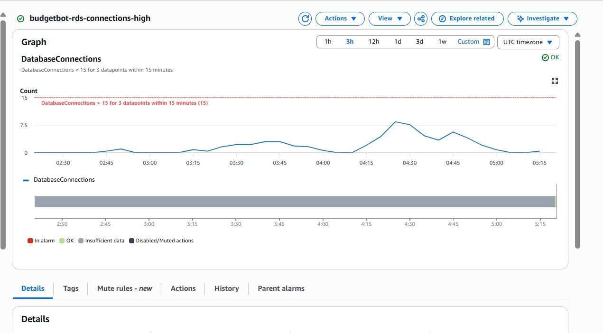
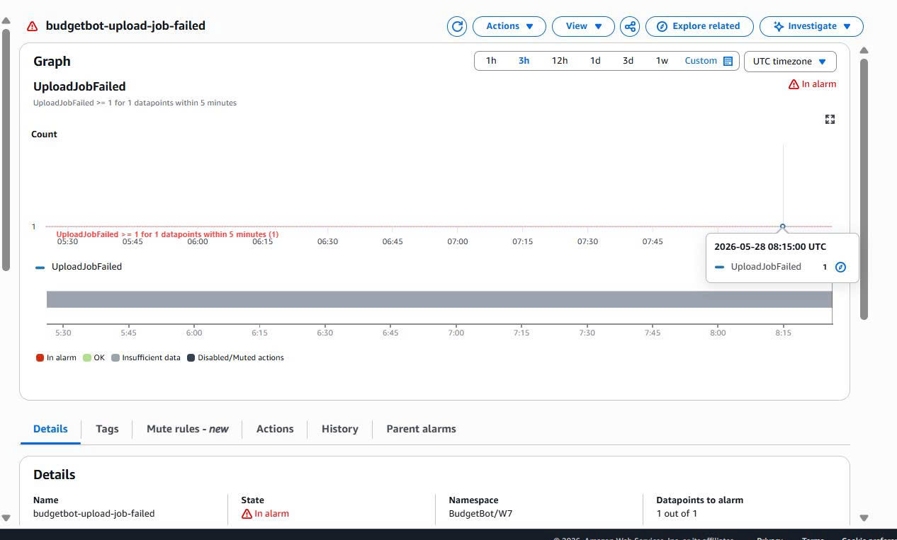

# CloudWatch Observability Evidence Framework — BudgetBot W7

## 1. Mục tiêu theo dõi

Kiến trúc hiện tại/dự kiến của BudgetBot:

```text
Frontend / Internet
→ API Gateway
→ 1 Lambda container image
→ S3 Presigned URL
→ S3 upload bucket
→ SQS Queue
→ cùng 1 Lambda xử lý async
→ Bedrock Runtime
→ RDS PostgreSQL
→ Secrets Manager
```

CloudWatch được dùng để trả lời các câu hỏi vận hành:

```text
1. API có đang lỗi hoặc chậm không?
2. Lambda có error, timeout, throttle hoặc memory quá thấp không?
3. SQS có bị backlog không?
4. Job upload đã đi tới stage nào?
5. Bedrock có chậm/lỗi hoặc bị gọi quá nhiều không?
6. RDS có quá tải CPU/connection không?
7. Khi lỗi xảy ra, lỗi nằm ở API Gateway, Lambda, S3, SQS, Bedrock hay RDS?
```

---

## 2. Evidence 

```text
docs/evidence/cloudwatch/
├── 01-api-gateway-dashboard.png
├── 02-api-gateway-5xx-alarm.png
├── 03-api-gateway-latency-alarm.png
├── 04-lambda-metrics.png
├── 05-lambda-errors-alarm.png
├── 06-lambda-duration-alarm.png
├── 07-lambda-throttles-alarm.png
├── 08-lambda-log-upload-success.png
├── 09-sqs-metrics.png
├── 10-sqs-age-alarm.png
├── 11-dlq-message-alarm.png
├── 12-rds-metrics.png
├── 13-rds-connections-alarm.png
├── 14-custom-metrics-budgetbot-w7.png
└── 15-cloudwatch-dashboard-budgetbot.png
```

---

## 3. API Gateway monitoring

### Metrics cần theo dõi

| Metric | Ý nghĩa | Evidence cần chụp |
|---|---|---|
| Count | Tổng số request API | API Gateway dashboard có request count |
| 4XX / 4XXError | Lỗi phía client: request sai, route sai, auth/CORS/validation | Biểu đồ 4XX |
| 5XX / 5XXError | Lỗi phía backend/API Gateway/Lambda integration | Alarm 5XX |
| Latency | Tổng thời gian API Gateway xử lý request | Biểu đồ latency |
| IntegrationLatency | Thời gian API Gateway chờ backend/Lambda | Biểu đồ integration latency |

### Alarm 

#### Alarm:  API Gateway 5XX High Alarm
### Mục đích

Alarm `budgetbot-api-5xx-high` được tạo để theo dõi lỗi server-side tại tầng API Gateway của hệ thống BudgetBot. Alarm này giúp phát hiện khi API Gateway trả về nhiều lỗi `5xx`, thường liên quan đến lỗi backend, Lambda integration, timeout, lỗi code trong Lambda, hoặc lỗi từ các service phụ thuộc như Bedrock, RDS, S3, Secrets Manager.

Trong kiến trúc BudgetBot, API Gateway là entry point cho frontend, nên việc monitor `5xx` giúp nhóm phát hiện sớm khi người dùng không thể gọi API thành công.

### Cấu hình alarm

| Thành phần | Giá trị |
|---|---|
| Namespace | `AWS/ApiGateway` |
| Metric name | `5xx` |
| ApiId | `nkpmczaztg` |
| Stage | `$default` |
| Statistic | `Sum` |
| Period | `5 minutes` |
| Threshold | `>= 5` |
| Evaluation | `1 datapoint within 5 minutes` |
| Alarm name | `budgetbot-api-5xx-high` |
| Notification | SNS topic `budgetbot-cloudwatch-alerts` |

### Ý nghĩa các thông số

- `Metric name: 5xx`: theo dõi số lượng response lỗi 5XX từ API Gateway.
- `Statistic: Sum`: cộng tổng số lỗi 5XX trong mỗi khoảng thời gian.
- `Period: 5 minutes`: kiểm tra lỗi theo từng cửa sổ thời gian 5 phút.
- `Threshold >= 5`: nếu có từ 5 lỗi 5XX trở lên trong 5 phút thì alarm chuyển sang trạng thái `ALARM`.
- `SNS topic budgetbot-cloudwatch-alerts`: khi alarm bật, CloudWatch gửi cảnh báo đến SNS topic để thông báo cho người vận hành.

### Khi nào alarm này sẽ bật?

Alarm sẽ bật khi API Gateway trả về ít nhất 5 lỗi 5XX trong vòng 5 phút. Điều này có thể xảy ra khi:

- Lambda backend bị lỗi runtime.
- API Gateway không gọi được Lambda integration.
- Lambda timeout.
- Backend xử lý `/upload`, `/process`, `/summary`, hoặc `/transactions` bị lỗi.
- Service phụ thuộc như Bedrock, RDS, S3 hoặc Secrets Manager gặp lỗi.
- Backend trả response không hợp lệ cho API Gateway.

### Giá trị vận hành

Alarm này giúp nhóm phát hiện lỗi ở tầng public API sớm hơn thay vì chờ người dùng báo lỗi. Khi alarm bật, nhóm sẽ kiểm tra API Gateway access logs và Lambda CloudWatch logs để xác định lỗi nằm ở route nào và stage nào trong workflow.


#### Alarm: API Gateway Latency High Alarm
### Mục đích

Alarm `budgetbot-api-latency-high` được tạo để theo dõi độ trễ phản hồi của API Gateway trong hệ thống BudgetBot.

Metric `Latency` cho biết tổng thời gian từ lúc API Gateway nhận request từ frontend cho đến khi trả response về client. Alarm này giúp phát hiện khi API phản hồi chậm bất thường, ảnh hưởng đến trải nghiệm người dùng.

Trong kiến trúc BudgetBot, độ trễ API có thể tăng do Lambda cold start, Lambda xử lý lâu, backend gọi Bedrock chậm, query RDS chậm, hoặc các workflow nặng như `/upload-request`, `/process`, `/summary`, `/transactions`.

### Cấu hình alarm

| Thành phần | Giá trị |
|---|---|
| Alarm name | `budgetbot-api-latency-high` |
| Namespace | `AWS/ApiGateway` |
| Metric name | `Latency` |
| ApiId | `nkpmczaztg` |
| Stage | `$default` |
| Statistic | `Average` |
| Period | `5 minutes` |
| Threshold | `> 5000 ms` |
| Evaluation | `1 datapoint within 5 minutes` |
| Notification | SNS topic `budgetbot-cloudwatch-alerts` |

### Ý nghĩa các thông số

- `Metric name: Latency`: đo tổng thời gian xử lý request tại API Gateway.
- `Statistic: Average`: lấy độ trễ trung bình trong mỗi khoảng thời gian.
- `Period: 5 minutes`: CloudWatch gom dữ liệu theo từng cửa sổ 5 phút.
- `Threshold > 5000 ms`: nếu độ trễ trung bình vượt quá 5 giây thì alarm chuyển sang trạng thái `ALARM`.
- `1 datapoint within 5 minutes`: chỉ cần một datapoint vượt ngưỡng trong 5 phút là alarm được kích hoạt.
- `SNS topic budgetbot-cloudwatch-alerts`: khi alarm bật, CloudWatch gửi cảnh báo qua SNS để người vận hành biết API đang phản hồi chậm.

### Khi nào alarm này sẽ bật?

Alarm sẽ bật khi API Gateway có latency trung bình lớn hơn 5000 ms trong vòng 5 phút. Một số nguyên nhân có thể là:

- Lambda cold start.
- Lambda container xử lý request lâu.
- Endpoint `/upload-request` hoặc `/process` xử lý file chậm.
- Bedrock inference latency cao.
- RDS query hoặc insert dữ liệu chậm.
- Backend bị nghẽn do nhiều request đồng thời.
- Network/VPC endpoint hoặc downstream service phản hồi chậm.

### Giá trị vận hành

Alarm này giúp nhóm phát hiện sớm tình trạng API phản hồi chậm trước khi người dùng gặp trải nghiệm xấu. Khi alarm bật, nhóm sẽ kiểm tra API Gateway access logs, Lambda duration metrics, Lambda logs, Bedrock latency, và RDS metrics để xác định nguyên nhân gây chậm.


#### Alarm: Lambda Errors
Alarm `budgetbot-lambda-errors-high` được tạo để theo dõi lỗi runtime của Lambda `budgetbot-main-image-lambda`.

| Thành phần | Giá trị |
|---|---|
| Namespace | `AWS/Lambda` |
| Function name | `budgetbot-main-image-lambda` |
| Metric | `Errors` |
| Statistic | `Sum` |
| Period | `5 minutes` |
| Threshold | `>= 1` |
| Notification | `budgetbot-cloudwatch-alerts` |

Alarm này sẽ bật khi Lambda có ít nhất 1 lỗi trong 5 phút. Điều này giúp phát hiện sớm các lỗi backend như exception trong code, timeout, lỗi gọi S3, Bedrock, RDS hoặc Secrets Manager.

Khi alarm bật, nhóm sẽ kiểm tra CloudWatch Logs của Lambda để xác định lỗi xảy ra ở route hoặc stage nào trong workflow.


#### Alarm: Lambda Duration near timeout
Alarm `budgetbot-lambda-duration-high` được tạo để theo dõi thời gian xử lý của Lambda `budgetbot-main-image-lambda`.

| Thành phần | Giá trị |
|---|---|
| Namespace | `AWS/Lambda` |
| Function name | `budgetbot-main-image-lambda` |
| Metric | `Duration` |
| Statistic | `p90` |
| Period | `5 minutes` |
| Threshold | `> 150000 ms` |
| Evaluation | `2 out of 3 datapoints within 15 minutes` |
| Notification | `budgetbot-cloudwatch-alerts` |

### Mục đích

Alarm này giúp phát hiện khi Lambda xử lý quá lâu và gần chạm timeout. Trong hệ thống BudgetBot, Lambda xử lý nhiều tác vụ backend như tạo presigned URL, xử lý file CSV/PDF, gọi Bedrock, ghi dữ liệu vào RDS và đọc/ghi S3.

### Ý nghĩa cấu hình

- `Duration`: đo thời gian chạy của Lambda cho mỗi invocation.
- `p90`: theo dõi nhóm request chậm hơn thay vì chỉ nhìn trung bình.
- `Threshold > 150000 ms`: cảnh báo khi 90% invocation trong period có duration vượt 150 giây.
- `2 out of 3 datapoints`: tránh báo động giả do một request đơn lẻ chậm bất thường.
- `SNS topic`: gửi cảnh báo qua `budgetbot-cloudwatch-alerts` khi alarm bật.

### Giá trị vận hành

Alarm này có giá trị để phát hiện các vấn đề hiệu năng như xử lý file lớn quá lâu, Bedrock phản hồi chậm, RDS insert/query chậm, hoặc downstream service bị nghẽn. Khi alarm bật, nhóm sẽ kiểm tra Lambda logs, API Gateway latency, Bedrock latency và RDS metrics để tìm nguyên nhân.


#### Alarm: Lambda Throttles
Alarm `budgetbot-lambda-throttles-high` được tạo để theo dõi số lần Lambda `budgetbot-main-image-lambda` bị throttle.

| Thành phần | Giá trị |
|---|---|
| Namespace | `AWS/Lambda` |
| Function name | `budgetbot-main-image-lambda` |
| Metric | `Throttles` |
| Statistic | `Sum` |
| Period | `5 minutes` |
| Threshold | `>= 1` |
| Notification | `budgetbot-cloudwatch-alerts` |

Alarm này sẽ bật khi Lambda bị throttle ít nhất 1 lần trong 5 phút. Điều này cho thấy Lambda có thể đã chạm giới hạn concurrency hoặc hệ thống đang có traffic spike.

Alarm này có giá trị vì BudgetBot dùng một Lambda để xử lý nhiều route và workflow. Nếu Lambda bị throttle, các request từ API Gateway hoặc job xử lý file có thể bị chậm hoặc thất bại.


## 5. SQS / DLQ monitoring

Áp dụng khi dùng:

```text
S3 ObjectCreated
→ SQS
→ cùng 1 Lambda xử lý async
```

### Metrics cần theo dõi

| Metric | Ý nghĩa |
|---|---|
| ApproximateNumberOfMessagesVisible | Số message đang chờ xử lý |
| ApproximateAgeOfOldestMessage | Message cũ nhất đã chờ bao lâu |
| NumberOfMessagesSent | Số message được gửi vào queue |
| NumberOfMessagesDeleted | Số message xử lý thành công |
| DLQ ApproximateNumberOfMessagesVisible | Số job đã fail nhiều lần |

### Alarm đề xuất

#### Alarm: SQS backlog high

```text
Metric: ApproximateNumberOfMessagesVisible
Threshold: > 100
Period: 5 minutes
```

Evidence:

```text
docs/evidence/cloudwatch/09-sqs-metrics.png
```

#### Alarm: SQS oldest message age high
Alarm `budgetbot-sqs-oldest-message-age-high` được tạo để theo dõi độ tuổi của message cũ nhất trong main SQS queue `budgetbot-process-queue`.

| Thành phần | Giá trị |
|---|---|
| Namespace | `AWS/SQS` |
| Queue | `budgetbot-process-queue` |
| Metric | `ApproximateAgeOfOldestMessage` |
| Statistic | `Maximum` |
| Period | `5 minutes` |
| Threshold | `> 300 seconds` |
| Evaluation | `2 out of 2 datapoints` |
| Notification | `budgetbot-cloudwatch-alerts` |

### Mục đích

Alarm này dùng để phát hiện khi các job xử lý file bị tồn đọng trong main queue quá lâu. Trong flow của BudgetBot, sau khi người dùng upload file lên S3 bằng presigned URL, S3 sẽ gửi event vào `budgetbot-process-queue`, sau đó Lambda lấy message từ queue để xử lý file, gọi Bedrock và ghi kết quả vào RDS.

### Ý nghĩa

Nếu `ApproximateAgeOfOldestMessage` vượt quá `300 seconds`, nghĩa là message cũ nhất đã chờ hơn 5 phút trong queue. Điều này có thể cho thấy:

- Lambda worker chưa xử lý kịp.
- Lambda xử lý lỗi và message bị retry.
- Bedrock hoặc RDS phản hồi chậm.
- Queue đang bị backlog do nhiều file upload cùng lúc.
- Event source mapping giữa SQS và Lambda có vấn đề.

### Giá trị vận hành

Alarm này có giá trị vì nó theo dõi trực tiếp trạng thái của workflow async. API Gateway hoặc Lambda có thể vẫn hoạt động, nhưng nếu message trong SQS bị kẹt lâu, file upload của người dùng vẫn chưa được xử lý hoàn tất. Khi alarm bật, nhóm sẽ kiểm tra SQS queue, Lambda logs, DLQ, S3 object key và downstream services như Bedrock/RDS để tìm nguyên nhân.

Trong evidence, metric từng tăng lên khoảng 20 phút, cho thấy alarm này thực sự giúp phát hiện tình trạng job bị tồn đọng trong hàng đợi xử lý.


#### Alarm: DLQ has messages

Alarm `budgetbot-dlq-has-messages` được tạo để theo dõi Dead-Letter Queue `budgetbot-process-dlq`.

| Thành phần | Giá trị |
|---|---|
| Namespace | `AWS/SQS` |
| Queue | `budgetbot-process-dlq` |
| Metric | `ApproximateNumberOfMessagesVisible` |
| Statistic | `Maximum` |
| Period | `5 minutes` |
| Threshold | `>= 1 message` |
| Evaluation | `1 out of 1 datapoint` |
| Notification | `budgetbot-cloudwatch-alerts` |

Alarm này sẽ bật khi có ít nhất một message trong DLQ. Điều này cho thấy một job xử lý file đã thất bại nhiều lần ở main queue và được chuyển sang DLQ.

Alarm này có giá trị vì DLQ chứa các job không xử lý thành công, ví dụ do lỗi parse file, lỗi Bedrock, lỗi RDS, thiếu quyền S3 hoặc lỗi code trong Lambda worker. Khi alarm bật, nhóm sẽ kiểm tra message body trong DLQ, Lambda logs và S3 object key để xác định file/job nào bị lỗi.


## 6. RDS monitoring

### Metrics cần theo dõi

| Metric | Ý nghĩa |
|---|---|
| CPUUtilization | DB CPU có cao không |
| DatabaseConnections | Số connection tới DB |
| FreeableMemory | Memory còn lại |
| FreeStorageSpace | Storage còn lại |
| ReadLatency / WriteLatency | DB read/write chậm không |
| ReadIOPS / WriteIOPS | I/O load |

#### Alarm: RDS DatabaseConnections high
Alarm `budgetbot-rds-connections-high` được tạo để theo dõi số lượng kết nối đang mở tới RDS PostgreSQL `budgetbot-db`.

| Thành phần | Giá trị |
|---|---|
| Namespace | `AWS/RDS` |
| DB instance | `budgetbot-db` |
| Metric | `DatabaseConnections` |
| Statistic | `Average` |
| Period | `5 minutes` |
| Threshold | `> 15 connections` |
| Evaluation | `2 out of 3 datapoints` |
| Notification | `budgetbot-cloudwatch-alerts` |

Alarm này giúp phát hiện khi RDS có dấu hiệu bị áp lực connection, thường do nhiều Lambda invocation chạy đồng thời hoặc backend không quản lý connection tốt. Khi alarm bật, nhóm sẽ kiểm tra Lambda concurrency, Lambda logs, RDS metrics và cân nhắc dùng RDS Proxy hoặc connection pooling.


## 7. Custom metrics namespace BudgetBot/W7

Namespace đề xuất:

```text
BudgetBot/W7
```

### Metrics cho Presigned URL + SQS async workflow

| Metric | Emit khi nào | Mục đích |
|---|---|---|
| UploadJobCreated | POST /upload-request tạo job | Đếm số upload request |
| PresignedUrlGenerated | Lambda tạo URL thành công | Xác nhận upload-request hoạt động |
| PresignedUrlFailed | Tạo URL lỗi | Phát hiện IAM/S3/env lỗi |
| S3ObjectReceived | Worker nhận event từ SQS | File thật sự đã lên S3 |
| SQSMessageProcessed | Worker xử lý message thành công | Theo dõi queue processing |
| SQSMessageFailed | Worker xử lý message lỗi | Phát hiện worker lỗi |
| UploadJobSucceeded | Job hoàn tất | End-to-end success |
| UploadJobFailed | Job fail | End-to-end failure |
| RowsParsed | Parse CSV xong | Biết file lớn bao nhiêu |
| RowsInserted | Insert RDS xong | Biết ghi DB được bao nhiêu dòng |
| RowsFailed | Dòng lỗi format/validation | Data quality issue |
| BedrockCalls | Mỗi lần gọi Bedrock | Theo dõi usage/cost |
| BedrockFailures | Bedrock lỗi | AI dependency issue |
| BedrockLatencyMs | Sau mỗi call Bedrock | Theo dõi độ trễ AI |
| RDSWriteLatencyMs | Khi ghi RDS | Theo dõi DB write performance |
| JobProcessingLatencyMs | Job hoàn tất | Tổng thời gian xử lý job |


### Custom Metric UploadJobFailed Alarm

Alarm `budgetbot-upload-job-failed` được tạo từ custom namespace `BudgetBot/W7` để theo dõi lỗi ở cấp workflow upload-processing.

| Thành phần | Giá trị |
|---|---|
| Namespace | `BudgetBot/W7` |
| Metric | `UploadJobFailed` |
| Route | `sqs_worker` |
| Statistic | `Sum` |
| Period | `5 minutes` |
| Threshold | `>= 1` |
| Evaluation | `1 out of 1 datapoint` |
| Notification | `budgetbot-cloudwatch-alerts` |

Alarm này sẽ bật khi có ít nhất một job upload/process thất bại trong 5 phút. Đây là custom metric có giá trị vì CloudWatch mặc định chỉ biết Lambda error, API 5XX hoặc SQS backlog, nhưng không biết chính xác một job xử lý file của BudgetBot đã thất bại ở cấp nghiệp vụ.

Trong evidence, metric `UploadJobFailed` và `SQSMessageFailed` đã xuất hiện trong namespace `BudgetBot/W7`, chứng minh Lambda worker đã emit metric khi workflow async xử lý message thất bại.

## 8. CloudWatch Dashboard

Dashboard `budgetbot-w7-observability-dashboard` được tạo để tổng hợp các metric quan trọng của hệ thống BudgetBot vào một màn hình vận hành.

Dashboard bao gồm các nhóm metric chính:

| Nhóm | Metric theo dõi | Mục đích |
|---|---|---|
| API Gateway | Count, 4xx, 5xx, Latency, IntegrationLatency | Theo dõi entry point, lỗi API và độ trễ |
| Lambda | Invocations, Errors, Duration, Throttles, ConcurrentExecutions | Theo dõi backend runtime health |
| SQS Main Queue | MessagesVisible, MessagesNotVisible, AgeOfOldestMessage, Sent/Received/Deleted | Theo dõi backlog và tiến độ xử lý async |
| DLQ | ApproximateNumberOfMessagesVisible | Phát hiện job xử lý thất bại sau retry |
| RDS | DatabaseConnections | Theo dõi áp lực connection vào PostgreSQL |
| BudgetBot/W7 | UploadJobCreated, RowsParsed, RowsInserted, UploadJobSucceeded, UploadJobFailed | Theo dõi workflow nghiệp vụ upload-processing |

Dashboard này giúp nhóm quan sát toàn bộ luồng từ frontend/API Gateway đến Lambda, SQS, RDS và custom workflow metrics. Khi alarm bật, nhóm có thể dùng dashboard để xác định nhanh lỗi nằm ở tầng API, backend, queue, database hay workflow nghiệp vụ.

## 9. Kết luận: Các cấu hình CloudWatch giúp gì cho dự án

Các cấu hình CloudWatch trong BudgetBot giúp dự án chuyển từ trạng thái “chỉ biết app chạy hay lỗi” sang trạng thái có thể quan sát, cảnh báo và điều tra nguyên nhân theo từng tầng của kiến trúc.

Thứ nhất, API Gateway monitoring giúp theo dõi entry point của hệ thống. Các metric như `5xx` và `Latency` cho biết API có đang lỗi hoặc phản hồi chậm với người dùng hay không. Khi người dùng không thể tải dữ liệu hoặc upload file, nhóm có thể kiểm tra API Gateway trước để biết lỗi nằm ở tầng public API hay phía backend.

Thứ hai, Lambda monitoring giúp theo dõi sức khỏe của backend chính. Vì BudgetBot dùng một Lambda container image để xử lý nhiều route và cả workflow async, các alarm như `Lambda Errors`, `Lambda Duration`, và `Lambda Throttles` giúp phát hiện lỗi runtime, xử lý gần timeout, hoặc bị giới hạn concurrency. Điều này đặc biệt quan trọng khi nhiều request hoặc nhiều job xử lý file chạy cùng lúc.

Thứ ba, SQS và DLQ monitoring giúp kiểm soát luồng xử lý bất đồng bộ. `ApproximateAgeOfOldestMessage` phát hiện khi job bị kẹt hoặc backlog trong main queue, còn DLQ alarm phát hiện các job đã thất bại sau nhiều lần retry. Nhờ đó, việc upload file bằng presigned URL không chỉ dừng ở việc file đã lên S3, mà còn theo dõi được file đó có thật sự được xử lý hay không.

Thứ tư, RDS `DatabaseConnections` alarm giúp phát hiện áp lực kết nối tới PostgreSQL. Đây là rủi ro thực tế của kiến trúc serverless vì Lambda có thể scale nhanh và mở nhiều database connections cùng lúc. Alarm này giúp nhóm biết khi nào cần tối ưu connection pooling, giới hạn concurrency hoặc cân nhắc RDS Proxy.

Thứ năm, custom metrics namespace `BudgetBot/W7` giúp theo dõi workflow ở cấp nghiệp vụ. Các metric như `UploadJobCreated`, `RowsParsed`, `RowsInserted`, `UploadJobSucceeded`, và `UploadJobFailed` cho biết một file upload đã đi qua những bước nào, parse được bao nhiêu dòng, insert được bao nhiêu dòng và job có thành công hay thất bại không. Đây là phần mà CloudWatch metric mặc định không thể tự cung cấp.

Cuối cùng, CloudWatch Dashboard tổng hợp giúp nhóm nhìn toàn bộ hệ thống trong một màn hình: API Gateway, Lambda, SQS, DLQ, RDS và custom workflow metrics. Khi có alarm, dashboard giúp xác định nhanh vấn đề nằm ở API, backend, queue, database hay workflow nghiệp vụ. Nhờ vậy, BudgetBot có khả năng vận hành tốt hơn, debug nhanh hơn, giảm thời gian phát hiện lỗi và chứng minh được hệ thống có observability đầy đủ cho luồng upload-processing.
